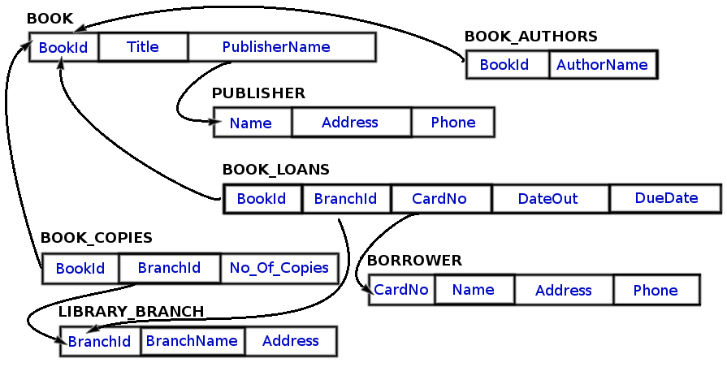

# Library-Database
SQL used to create and query database

This was a project at The Tech Academy in which I created a database based on a provided schema and wrote queries to answer the questions listed below.

<h3>Schema</h3>

<h3>Stored Procedures created to answer:</h3>
<ol>
<li>How many copies of the book titled "The Lost Tribe" are owned by the library branch whose name is "Sharpstown"?</li>
<li>How many copies of the book titled "The Lost Tribe" are owned by each library branch?</li>
<li>Retrieve the names of all borrowers who do not have any books checked out.</li>
<li>For each book that is loaned out from the "Sharpstown" branch and whose DueDate is today, retrieve the book title, the borrower's name, and the borrower's address.</li>
<li>For each library branch, retrieve the branch name and the total number of books loaned out from that branch.</li>
<li>Retrieve the names, addresses, and number of books checked out for all borrowers who have more than five books checked out.</li>
<li>For each book authored (or co-authored) by "Stephen King", retrieve the title and the number of copies owned by the library branch whose name is "Central".</li>
</ol>
